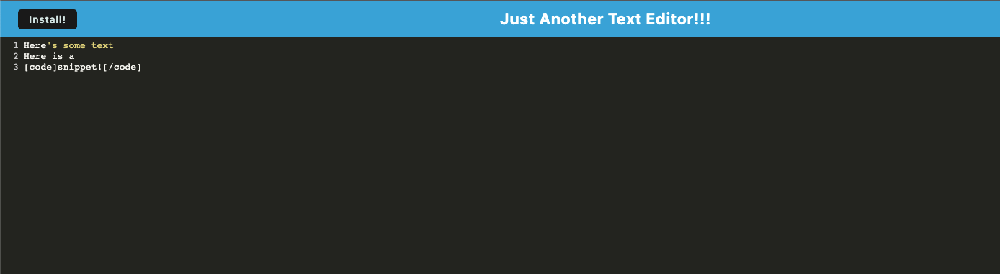

# PWA Text Editor

## Description

This application allows a user to create notes or code snippets that are cached to the broswer and stored using IndexDB. The app also can be downloaded to run offline without losing data.

## Table of Contents

- [Installation](#installation)
- [Usage](#usage)
- [License](#license)
- [Contributing](#contributing)
- [Tests](#tests)
- [Questions](#questions)
- [Credits](#credits)

## Installation

Visit the deployed heroku app and use the "Install" button to save the app to your machine as needed.

## Usage

Enjoy persistent storage of your notes and code snippets.

## License

PWA Text Editor is covered under the ISC License, as outlined at the [ISC License page on ChooseALicense](https://choosealicense.com/licenses/isc/)

## Contributing

Contributor Covenant, as described at [the Contributor Covenant website](https://www.contributor-covenant.org/)

## Tests

See screenshots below:

## Questions

If you any questions about this project please reach out to its creator via email at brian.campbell003@gmail.com or on GitHub from their [GitHub userpage](https://www.github.com/briancampbell003). Thank you!

## Credits

Development benefitted from previous activities in the NU Coding Boot Camp.

--
        